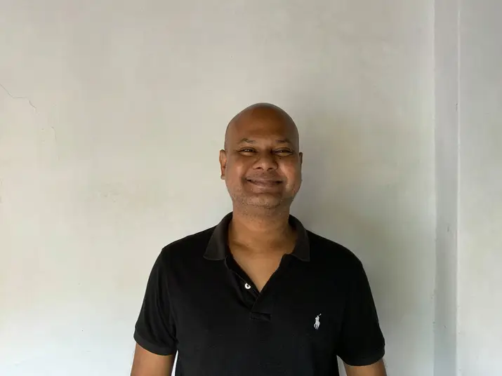

<details>
  <summary>Eid II Wishes</summary>
  
<details>
  <summary> greetingsServices</summary></details>details>

## Eid_II: Primary celebration and festival

- [ ]  Scale: Major impact
- [ ]  Category: Religion
- [ ]  Emotional range: Highly sensitive
- [ ]  Invitation at my home: Open for all
- [ ]  Vocal pitch: Minor chord
- [ ]  Dress: Festive and cheerful but nevermind

RASHADUL ISLAM ross
   - * B.Sc. in Computer Science, CA *
   - * B.Sc. in Computer Engineering, BD *

        - * Specialization: Computer System, Software Engineering *

            - * Expertise: Enterprise System or Software Design and Development, A.I., Consulting, Business Intelligence and Big Data, Liaison, Country Lead and university speech giving and so much in corporates, social responsibility & STEM charity *

## Greeting
> Eid is in you! Everything senses great if you make it sensible and attentive greatness. Happy holidays & feast to you and your f&f both at home and abroad.

> ঈদ আপনার মাঝেই! আপনি সর্বজনীন অবহিত ও স্বীকৃত বৈশিষ্ট্য অনুভূতিতে থাকলে, সবাই ভাল থাকবে। দেশে ও বিদেশে আপনার সবাইকে ও আপনাকে কাজের ছুটির আন্তরিক শুভেচ্ছা।

> L'Eid est en vous! Tout et bon si vous en faites une grandeur sensible et attentive. Joyeuses fêtes et fêtes à vous, à vos amis et à votre famille, tant chez vous qu'à l'étranger.

# Those who miss me: here says all


# Reach me
| Title      | Location |  Availability     |
| :---        |    :----:   |          ---: |
| Webex      | Gmail: rashadul.cse       | Always   |
| Postbox      | Outlook: itsme.rashadul       | Always   |
| SMS/Page  | +880 171 411 8395        |  Always      |
| Cell  | +880 171 411 8395        |  11PM to 11AM EDT      |
| Venue  | 25.7376062, 89.2598786        |  Always      |

```
**Thank you!**
```
</details>
